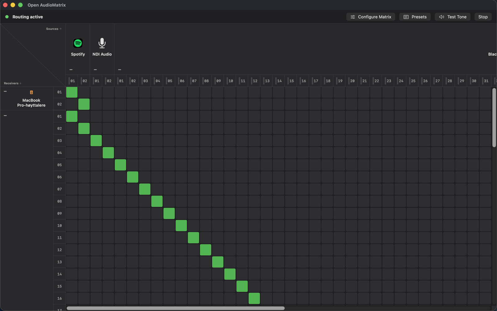

# Open AudioMatrix

Route application and input audio from a Mac to **physical multi-channel outputs** — USB audio interfaces, installed sound processors, Dante Virtual Soundcard, AVB endpoints, virtual devices like BlackHole, and anything else CoreAudio can see — with per-channel assignment and show presets.

Use it anywhere you need app audio on specific output channels: live events, installed sound, conference rooms, houses of worship, streaming, podcasting, and more.

Apps keep their normal macOS output setting. Open AudioMatrix intercepts per-app audio with Core Audio process taps and routes it to specific output channels on your hardware. Hardware inputs (microphones, Dante/NDI inputs, etc.) appear as matrix sources alongside apps.



## How it works

1. **Capture** each app's audio with Core Audio process taps (`muted` silences the app's direct output while routing; audio is heard only through the router). Hardware inputs are captured via CoreAudio device IO.
2. **Mix** captured streams in a central realtime mixer (SPSC rings per source, one IOProc per physical device)
3. **Play** the summed mix to your chosen output on specific mono channels (crosspoint routing in the matrix)

## Requirements

- macOS 15.0 or later
- Xcode 16+ / Swift 6
- **System Audio Recording** permission (and **Microphone** if routing from hardware inputs)

## Installing

Download the latest DMG from [Releases](https://github.com/BrekkeLiten/Open-AudioMatrix/releases) (or build it yourself, see [Building the app](#building-the-app)), open it, and drag **Open AudioMatrix** to Applications.

The app is ad-hoc signed, not notarized by Apple, so macOS blocks it the first time you open it. Right-click (or Control-click) the app in Finder, choose **Open**, then confirm. On recent macOS versions you may instead need to go to **System Settings → Privacy & Security** and click **Open Anyway**. You only need to do this once.

## Quick start

```bash
swift build

# Terminal A — engine daemon (optional; the app auto-launches it)
swift run AudioMatrixEngine

# Terminal B — CLI
swift run audiomatrix list-devices
swift run audiomatrix list
swift run audiomatrix add com.spotify.client --device "Scarlett 18i8" --ch 1 --src-ch 1
swift run audiomatrix start
swift run audiomatrix status

# SwiftUI matrix editor
swift run AudioMatrixApp
```

**Matrix editor workflow:**

1. **Configure Matrix** — choose which apps/sources and outputs appear in the grid
2. **Click crosspoints** to route a source channel to an output channel
3. **Shift+click** a crosspoint for a diagonal stereo patch (up to 2 channel pairs)
4. **Option+click** to connect and **mute** a route (patch stays, audio silenced)
5. **Start** routing when patches are set (auto-starts on launch by default; disable in Settings)
6. **Presets** — save/load show scenes (routes, mute state, labels, and matrix layout)
7. **Test Tone** — verify output channels with 440 Hz

Right-click an output channel row header to **rename** it (labels persist in presets).

## Example

```bash
swift run audiomatrix add us.zoom.xos --device "Scarlett 18i8" --ch 1 --src-ch 1
swift run audiomatrix add com.spotify.client --device "Scarlett 18i8" --ch 3 --src-ch 1
swift run audiomatrix label --device "Scarlett 18i8" --ch 1 "Zoom send"
swift run audiomatrix preset save board-meeting
swift run audiomatrix start
```

## CLI reference

| Command | Description |
|---|---|
| `list-devices` | Show available physical output devices |
| `list` | Show apps currently using audio |
| `add <bundleID> --device <output> --ch <n> [--src-ch <n>]` | Route one mono channel to one output channel |
| `remove <bundleID>` | Remove all routes for an app |
| `label --device <output> --ch <n> "text"` | Label an output channel |
| `start` / `stop` | Start or stop routing |
| `status` | Show routes, labels, test tone, and levels |
| `preset save\|load\|list` | Show/room preset scenes (session routes; app presets also store matrix layout) |
| `test-tone --device <output> --ch <n> [--signal sine\|white\|pink] [--off]` | Play a test signal (440 Hz sine by default) on a channel |
| `ping` | Check that the engine is running |

Each `--ch` and `--src-ch` value is a **mono channel number** (1, 2, 3…). Add multiple routes or use Shift+click in the app for stereo pairs.

Use `default` or a partial device name for `--device`. Run `list-devices` to see names, UIDs, and channel counts.

## Architecture

```
App/input audio → Process Tap / Device IO → SPSC ring → RealtimeMixer → PhysicalOutputSink → Hardware
```

| Module | Role |
|---|---|
| `AudioMatrixCapture` | Process taps, hardware input capture, physical output sinks, device hotplug listener |
| `AudioMatrixEngine` | RealtimeMixer, MixerEngine daemon, Unix socket IPC |
| `AudioMatrixCore` | RoutingSession, ChannelRouter, presets, EngineClient, matrix route codec |
| `AudioMatrixCLI` | `audiomatrix` command-line tool |
| `AudioMatrixApp` | SwiftUI routing matrix editor |

## Not currently included

- A virtual audio device (apps output to your real hardware; no driver install needed)
- Per-app volume / gain / trim
- Audio effects (EQ, compressor, limiter)

## Permissions

Include `NSAudioCaptureUsageDescription` and `NSMicrophoneUsageDescription` when distributing a signed app bundle. See `Supporting/AudioMatrixEngine-Info.plist` and `Supporting/AudioMatrixApp-Info.plist`. The app shows a first-launch guide to System Settings.

## Building the app

```bash
scripts/package-app.sh   # builds and ad-hoc signs dist/Open AudioMatrix.app
scripts/make-dmg.sh      # also wraps it in dist/Open AudioMatrix <version>.dmg
```

## Verification

```bash
swift build
swift test
swift run CoreSelfTest
```

## Project layout

```
Sources/AudioMatrixCapture/   Process taps, input capture, physical output sinks
Sources/AudioMatrixEngine/    RealtimeMixer, mixer daemon
Sources/AudioMatrixCLI/       audiomatrix CLI
Sources/AudioMatrixCore/      Routing model, channel matrix, presets, EngineClient
Sources/AudioMatrixApp/       SwiftUI routing matrix editor
```

## Contributing

Bug reports, ideas, and pull requests are welcome. See [CONTRIBUTING.md](CONTRIBUTING.md).

## License

MIT. See [LICENSE](LICENSE).
